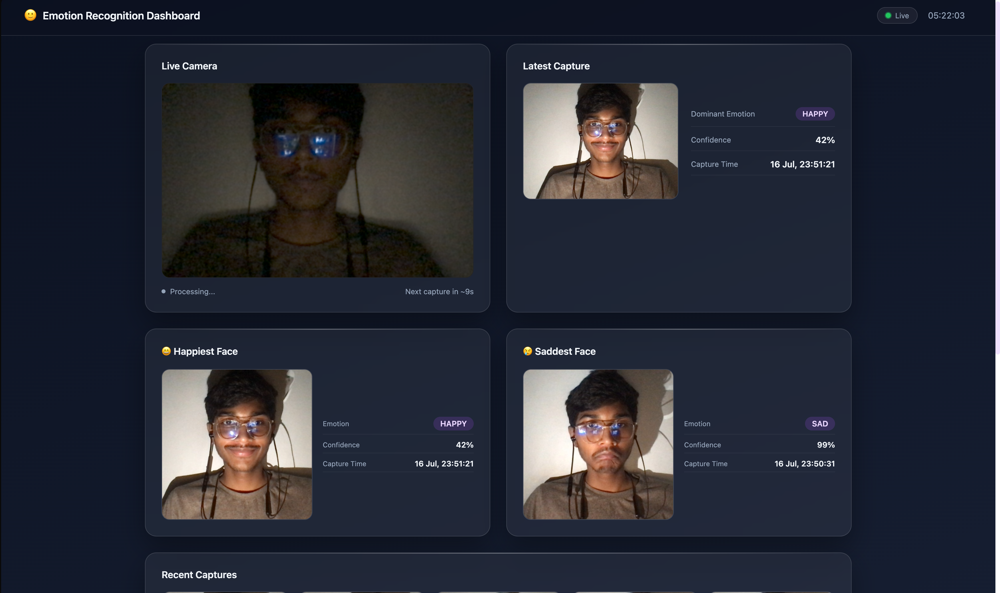
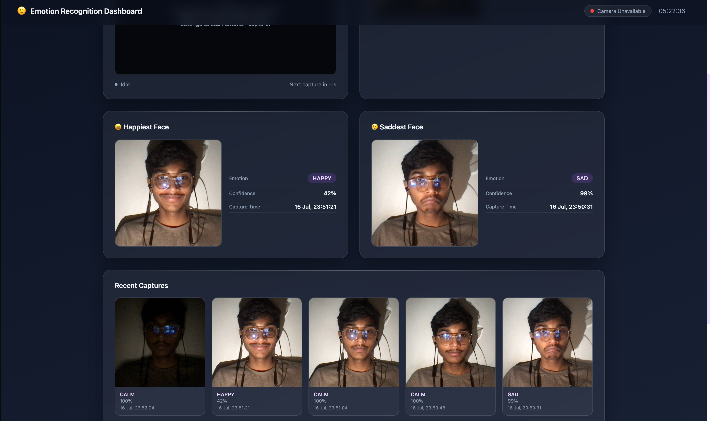
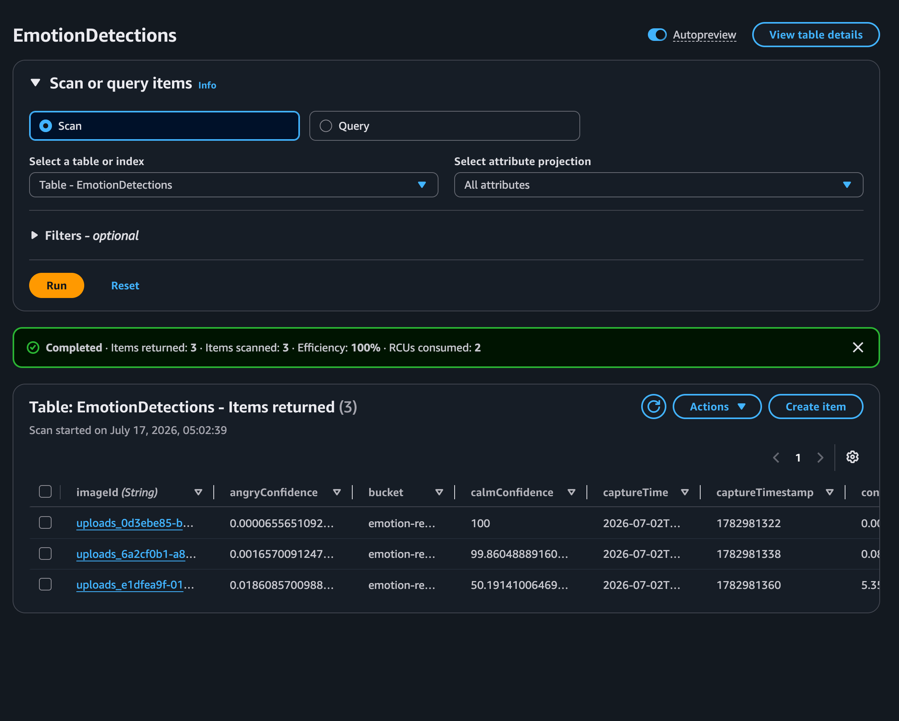
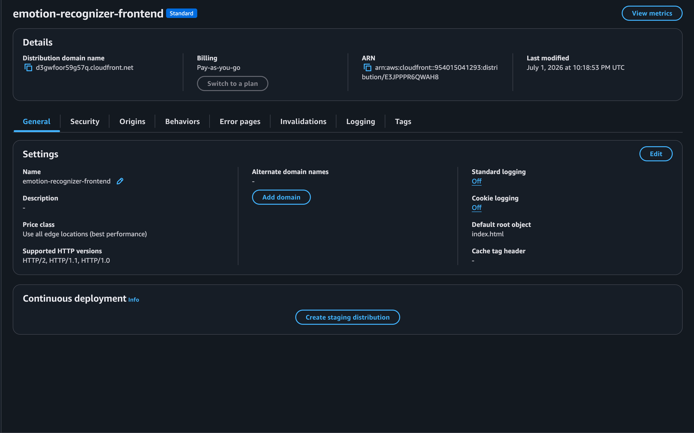
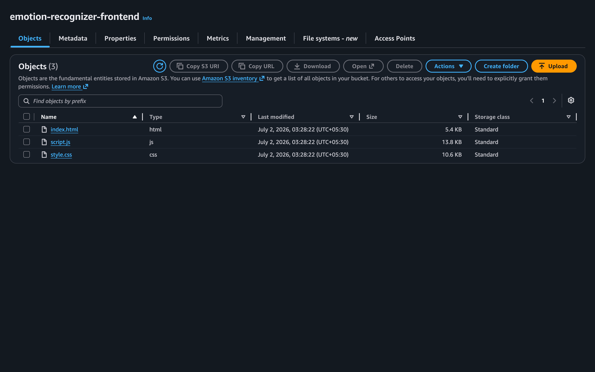
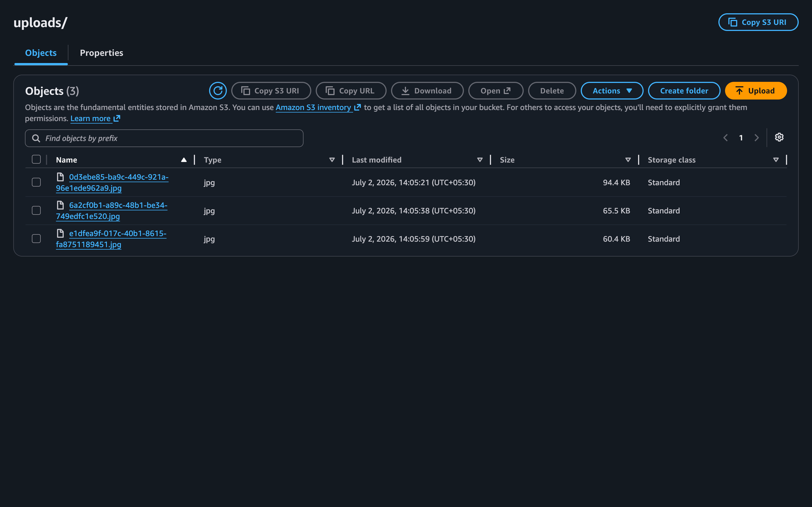

# 🙂 Emotion Recognition Dashboard

A serverless web application that captures facial images via a live browser camera, analyses emotions using Amazon Rekognition, and displays a real-time dashboard of results — including the most recent capture, the happiest face, the saddest face, and a scrollable history of recent captures.

---

## 📋 Project Overview

The Emotion Recognition Dashboard is a fully serverless AWS project with a vanilla HTML/CSS/JavaScript frontend. It accesses the device camera directly in the browser, periodically captures frames, uploads them to Amazon S3 via a pre-signed URL, and triggers a Lambda-based processing pipeline that calls Amazon Rekognition for facial emotion analysis. Results are stored in DynamoDB and surfaced to the frontend through an HTTP API via Amazon API Gateway.

The frontend is hosted on Amazon S3 and served over Amazon CloudFront, which provides HTTPS — required by modern browsers for camera access.

---

## ✨ Key Features

- **Live camera feed** — accesses the device camera directly in the browser; captures frames on a configurable interval
- **Automated emotion analysis** — each captured frame is uploaded to S3, triggering a Lambda that calls Amazon Rekognition `detect_faces` with all attributes
- **Eight-emotion scoring** — Happy, Sad, Angry, Calm, Confused, Disgusted, Surprised, Fear — all confidence scores stored per capture
- **Real-time dashboard** — Latest capture card, Happiest Face card, Saddest Face card, and a Recent Captures grid, all polled automatically
- **Pre-signed URL upload** — browser uploads directly to S3; no binary data passes through API Gateway
- **CloudFront delivery** — HTTPS hosting required for camera permissions in modern browsers
- **Connection status indicator** — live pill showing API connectivity and a live clock

---

## ☁️ AWS Services Used

| Service | Role |
|---|---|
| **Amazon S3** (×2) | One bucket for static website hosting; one bucket for uploaded image storage |
| **Amazon CloudFront** | HTTPS CDN delivery of the frontend (required for camera permissions) |
| **Amazon API Gateway** | HTTP API exposing routes: `/upload-url`, `/latest`, `/recent`, `/happiest`, `/saddest` |
| **AWS Lambda** (×3) | `upload_url` — generates pre-signed S3 URL; `emotion_processor` — S3-triggered, calls Rekognition, writes to DynamoDB; `emotion_dashboard` — serves all dashboard data |
| **Amazon Rekognition** | `detect_faces` API with `ALL` attributes for per-face emotion scoring |
| **Amazon DynamoDB** | `EmotionDetections` table; `LatestImagesIndex` GSI for efficient recency queries |
| **Amazon CloudWatch** | Lambda function logging and monitoring |

---

## 🏗️ System Architecture

```
Browser (Camera)
     │
     │  GET /upload-url
     ▼
Amazon API Gateway ──► upload_url (Lambda)
                              │
                              │ returns pre-signed PUT URL
                              ▼
                        Amazon S3 (data bucket)
                              │
                              │ S3 PUT event trigger
                              ▼
                     emotion_processor (Lambda)
                              │
                    ┌─────────┴──────────┐
                    │                    │
                    ▼                    ▼
           Amazon Rekognition      Amazon DynamoDB
           detect_faces()          EmotionDetections table
           (ALL attributes)

Browser (Dashboard)
     │
     │  GET /latest | /recent | /happiest | /saddest
     ▼
Amazon API Gateway ──► emotion_dashboard (Lambda)
                              │
                    ┌─────────┴──────────┐
                    │                    │
                    ▼                    ▼
           Amazon DynamoDB         Amazon S3
           (query/scan)         (pre-signed GET URLs)
```

The frontend is served from:

```
Amazon S3 (hosting bucket) ──► Amazon CloudFront (HTTPS)
```

---

## 🔄 Project Workflow

1. The browser accesses the device camera and renders a live `<video>` feed.
2. On each capture interval, the frontend calls `GET /upload-url` to receive a pre-signed S3 PUT URL and an `objectKey`.
3. The browser captures a frame from the video onto a `<canvas>`, converts it to a JPEG blob, and uploads it directly to S3 using the pre-signed URL.
4. The S3 PUT event triggers the `emotion_processor` Lambda.
5. `emotion_processor` calls Rekognition `detect_faces` with `Attributes=["ALL"]` to retrieve per-face emotion scores for eight emotion categories.
6. The dominant emotion and all eight individual confidence scores are stored as a new item in the `EmotionDetections` DynamoDB table.
7. The dashboard frontend polls the API endpoints (`/latest`, `/recent`, `/happiest`, `/saddest`) at regular intervals.
8. The `emotion_dashboard` Lambda queries DynamoDB — using the `LatestImagesIndex` GSI for recency queries and full-table scans for the extremes — and returns pre-signed GET URLs for each image.
9. The dashboard updates the Latest Capture card, the Happiest / Saddest Face cards, and the Recent Captures grid in the browser.

---

## 📸 Screenshots

### 🏠 Home Page



### 🕐 Recent Captures



### 📊 Emotion Table (DynamoDB)



### ☁️ CloudFront Distribution



### 🪣 Hosting S3 Bucket



### 🗄️ Data S3 Bucket



---

## 🔌 REST API Endpoints

Base URL: Amazon API Gateway HTTP API

| Method | Route | Lambda | Description |
|---|---|---|---|
| `GET` | `/upload-url` | `upload_url` | Returns a pre-signed S3 PUT URL and `objectKey` for a new upload |
| `GET` | `/latest` | `emotion_dashboard` | Returns the single most recent emotion detection record |
| `GET` | `/recent` | `emotion_dashboard` | Returns the 10 most recent emotion detection records |
| `GET` | `/happiest` | `emotion_dashboard` | Returns the record with the highest `happyConfidence` |
| `GET` | `/saddest` | `emotion_dashboard` | Returns the record with the highest `sadConfidence` |

All responses include CORS headers (`Access-Control-Allow-Origin: *`).

Image URLs in responses are pre-signed S3 GET URLs that expire in 300 seconds.

---

## 📁 Repository Structure

```
Emotion-Detection/
├── index.html                  # Single-page frontend application
├── script.js                   # All frontend logic (camera, API calls, DOM updates)
├── style.css                   # All frontend styles
├── lambda-functions/
│   ├── upload_url.py           # Generates pre-signed S3 PUT URL
│   ├── emotion_processor.py    # S3-triggered; calls Rekognition; writes to DynamoDB
│   └── emotion_dashboard.py    # Serves /latest, /recent, /happiest, /saddest
├── project_images/             # Screenshots for documentation
│   ├── home.png
│   ├── recents.png
│   ├── emotion-table.png
│   ├── cloudfront.png
│   ├── hosting-s3.png
│   └── data-s3.png
├── images/                     # Additional project images
└── PROJECT_METADATA.md         # Project metadata
```

---

## 🛠️ Technology Stack

### Frontend

| Technology | Detail |
|---|---|
| HTML5 | Semantic single-page structure |
| CSS3 | Vanilla CSS — custom layout, cards, overlays, animations |
| JavaScript (ES6+) | Vanilla JS — camera access (`getUserMedia`), `fetch`, DOM manipulation |

### Backend

| Technology | Detail |
|---|---|
| Python 3 | All Lambda functions written in Python using `boto3` |
| AWS Lambda | Serverless compute for all backend logic |

### AWS Infrastructure

| Service | Detail |
|---|---|
| Amazon S3 | Static hosting + image storage |
| Amazon CloudFront | HTTPS CDN |
| Amazon API Gateway | HTTP API |
| Amazon Rekognition | `detect_faces` with ALL attributes |
| Amazon DynamoDB | `EmotionDetections` table with `LatestImagesIndex` GSI |
| Amazon CloudWatch | Lambda logs |

---

## 🚀 Deployment

The frontend (HTML/CSS/JS) is deployed to an **Amazon S3** static website hosting bucket and served via **Amazon CloudFront** to provide HTTPS. HTTPS is a hard requirement: modern browsers only grant camera (`getUserMedia`) access on secure origins.

Lambda functions are deployed individually to **AWS Lambda** and connected to **Amazon API Gateway** (HTTP API).

No build step is required for the frontend — files are uploaded directly to S3.

---

## 🔁 CI/CD Pipeline

No CI/CD pipeline configuration file (`buildspec.yml` or equivalent) is present in this repository. Deployment is performed manually.

---

## 🎓 Learning Outcomes

- Implementing a fully serverless, event-driven image processing pipeline on AWS
- Using Amazon Rekognition `detect_faces` with full attribute extraction for multi-label emotion scoring
- Generating and consuming pre-signed S3 URLs for secure, direct browser-to-S3 uploads
- Designing DynamoDB access patterns using Global Secondary Indexes for efficient recency queries
- Hosting a static frontend on S3 + CloudFront to satisfy the HTTPS requirement for browser camera access
- Writing CORS-compliant Lambda response headers for cross-origin browser requests
- Polling-based real-time dashboard design without WebSockets or external frameworks

---

## 🔮 Future Improvements

- Secure login to restrict access and associate captures with individual users, improving data security and privacy.
- Add emotion trend charts over time using a time-series visualisation library.
- Support for multi-face detection in a single frame.
- Configurable capture interval exposed as a UI control.

---

## 👤 Author

**Sarvesh**  
GitHub: [sarvesh871](https://github.com/sarvesh871)  
Repository: [Emotion-Detection](https://github.com/sarvesh871/Emotion-Detection)
